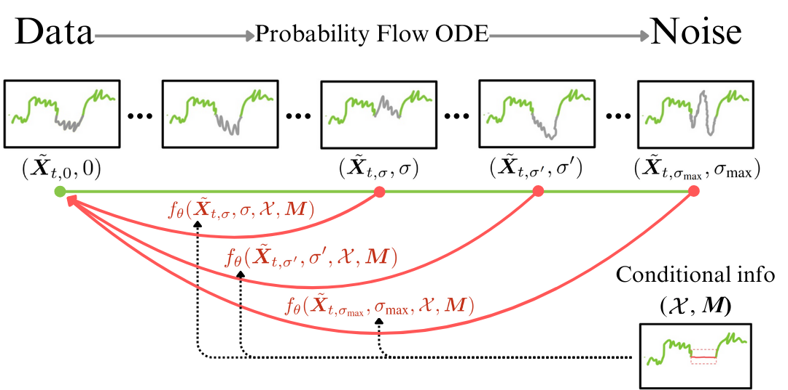
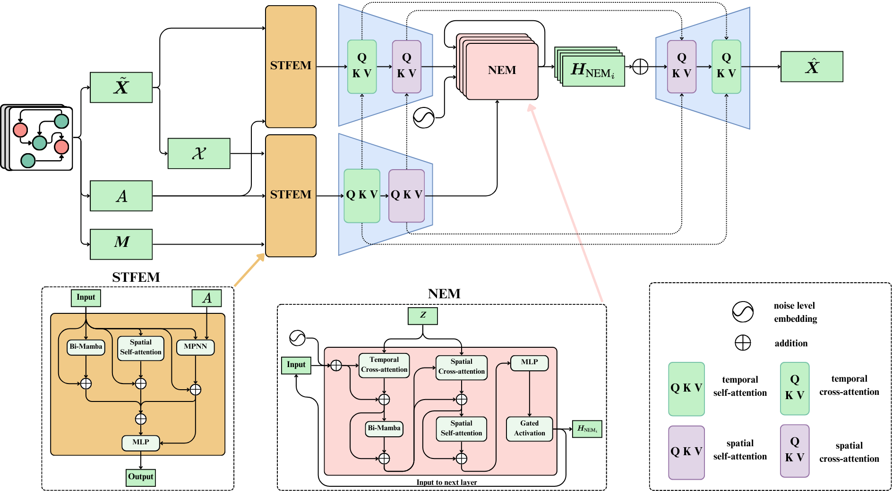

[](https://arxiv.org/abs/2501.19364)
# CoSTI: Consistency Models for (a faster) Spatio-Temporal Imputation

This repository contains the official implementation of **CoSTI**. CoSTI introduces a novel adaptation of Consistency Models (CMs) to the domain of Multivariate Time Series Imputation (MTSI), achieving significant reductions in inference (-98\%) time while maintaining competitive imputation accuracy.



## Introduction

Multivariate Time Series Imputation (MTSI) is a critical task in various domains like healthcare and traffic management, where incomplete data can compromise decision-making. Existing state-of-the-art methods, such as Denoising Diffusion Probabilistic Models (DDPMs), offer high imputation accuracy but suffer from high computational costs. CoSTI leverages **Consistency Training** to:

- Achieve comparable imputation quality to DDPMs.
- Drastically reduce inference times (up to 98% faster).
- Enable scalability for real-time applications.

For further details, please refer to our [paper](https://arxiv.org/abs/2501.19364).

## Framework

CoSTI combines concepts from Consistency Models and Multivariate Time Series Imputation to construct a framework optimized for speed and accuracy. The method includes:

- **Spatio-Temporal Feature Extraction Modules (STFEMs):** Extract spatio-temporal dependencies using transformers and Mamba blocks.
- **Noise Estimation Modules (NEMs):** Adapted for consistency models to predict Gaussian noise efficiently.
- **Deterministic Imputation:** Ensures robust and reproducible results by aggregating multiple imputations.



## Datasets

The following datasets are used for experiments:

1. **AQI-36:** Air quality dataset with 36 sensors.
2. **METR-LA and PEMS-BAY:** Traffic datasets covering Los Angeles and San Francisco.
3. **PhysioNet Challenge 2019:** Clinical dataset for ICU patient monitoring.

The datasets employed in this study are publicly available and free to use. Specifically:

- The **Torch SpatioTemporal library** ([Cini et al., 2022](https://github.com/TorchSpatiotemporal/tsl)) provides tools to download and preprocess the AQI-36, METR-LA, and PEMS-BAY datasets.
The **PhysioNet Challenge 2019 dataset** is accessible at [https://physionet.org/content/challenge-2019/1.0.0/](https://physionet.org/content/challenge-2019/1.0.0/). Alternatively, we explain how to obtain this dataset in our repository using a script later on.


## Requirements

You can set up the required environment in two ways:

1. **Using `requirements.txt` file:**

   Install the required packages directly:

   ```bash
   pip install -r requirements.txt
   ```

2. **Using `setup.sh`:**

   Build a Docker image and container for the project:

   ```bash
   sudo chmod +x setup.sh
   ./setup.sh
   ```

    This method creates a reproducible environment using Docker, simplifying dependency management.


## Download Pre-trained Weights and PhysioNet Challenge 2019 dataset

If you want to download the PhysioNet Challenge 2019 dataset or obtain the pre-trained weights, you can run the following script:

```bash
chmod +x download_data.sh
./download_data.sh
```


## Experiments

### Running Experiments

Each experiment can be replicated using the provided configuration files. To execute a specific experiment, use the following command:

```bash
python ./scripts/<experiment_script>.py --config-name <experiment_file>
```

### Training CoSTI

To replicate the training of CoSTI across five runs and obtain the average results, the following scripts can be executed for each dataset configuration:

```bash
python ./scripts/run_average_experiment.py --config-name aqi36
python ./scripts/run_average_experiment.py --config-name metr-la_point
python ./scripts/run_average_experiment.py --config-name metr-la_block
python ./scripts/run_average_experiment.py --config-name pems-bay_point
python ./scripts/run_average_experiment.py --config-name pems-bay_block
python ./scripts/run_average_experiment.py --config-name mimic-challenge
```

### Inference with CoSTI

We provide pre-trained weights for each dataset to enable testing and result replication using 2-step sampling. For example, for the AQI-36 dataset, you can run:

#### 1-Step Inference

```bash
python ./scripts/run_k_test_experiment.py --config-name aqi36 test_sigmas=[80]
```

#### 2-Step Inference

```bash
python ./scripts/run_k_test_experiment.py --config-name aqi36
```

You can modify the noise levels ($\sigma$\) and the number of steps by editing the configuration files in `./config/k_test/aqi36.yaml` or with the parameter test_sigmas in the command line.

### Sensitivity Analysis

To replicate the sensitivity analysis, execute the following:

```bash
python ./scripts/run_sensitivity_experiment.py --config-name metr-la_point
```

### Imputing Results

To perform imputation using the provided weights:

```bash
python ./scripts/impute_data.py --config-name aqi36
python ./scripts/impute_data.py --config-name metr-la_point
python ./scripts/impute_data.py --config-name metr-la_block
python ./scripts/impute_data.py --config-name pems-bay_point
python ./scripts/impute_data.py --config-name pems-bay_block
python ./scripts/impute_data.py --config-name mimic-challenge
```

## Citation

```bibtex
@article{solis2025costi,
  title={CoSTI: Consistency Models for (a faster) Spatio-Temporal Imputation},
  author={Sol{\'\i}s-Garc{\'\i}a, Javier and Vega-M{\'a}rquez, Bel{\'e}n and Nepomuceno, Juan A and Nepomuceno-Chamorro, Isabel A},
  journal={arXiv preprint arXiv:2501.19364},
  year={2025}
}
```
